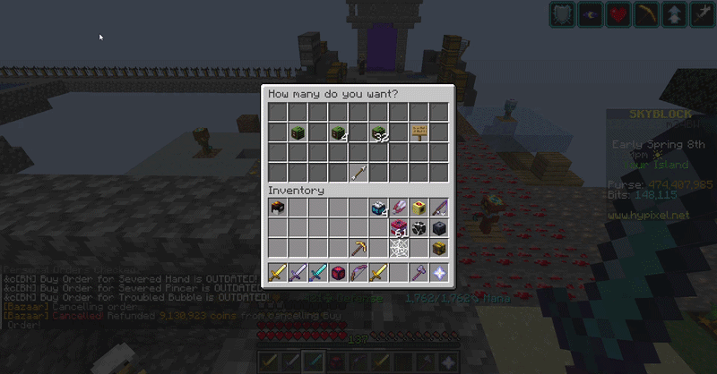
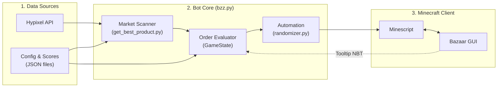

<p align="center">
  <h1 align="center">Hypixel Skyblock Bazaar Market Maker</h1>
</p>
<p align="center">
    <em>Order book market making bot for the Hypixel Skyblock Bazaar, built with Minescript and Python.</em>
</p>

---

**Source Code**: [https://github.com/your-username/bazaar-market-maker](https://github.com/your-username/bazaar-market-maker)

---

**Bazaar Market Maker** is a Python bot for the Hypixel Skyblock Bazaar. It automates order management through **Minescript** and uses Hypixel API data to quote buy and sell orders, capturing the bid-ask spread.

The key features are:

* **Market Making**: Quotes top buy orders and sell offers simultaneously to profit from the spread.
* **Order Pegging**: Updates orders when undercut or matched, adjusting prices by `±0.1` coins.
* **Product Scoring**: Ranks products by volume, spread, and market share with [get_best_product.py](get_best_product.py).
* **Human Delays**: Simulates human input using log-normal click delays, momentum, and typing delays via [randomizer.py](randomizer.py).
* **Order Lifecycle**: Manages the trading loop: `Buy Order` → `Claim Items` → `Sell Offer` → `Claim Coins`.
* **Safety Stops**: Exits on daily Bazaar limits, Limbo detection, or server reboot messages.
* **Auto-Recovery**: Handles screen timeouts and missed clicks with retries.
* **Hotkeys**: Press <kbd>x</kbd> to exit immediately or <kbd>c</kbd> to print current orders to chat.

---

## Demo

<p align="center">
  
</p>

---

## Architecture & Project Structure



| Component | Role |
| :--- | :--- |
| [bzz.py](bzz.py) | Main bot orchestrator, state machine, and automation loops. |
| [get_best_product.py](get_best_product.py) | Market scanner; ranks items by profit, volume, and Bazaar limit. |
| [randomizer.py](randomizer.py) | Generates log-normal human delays, typing speed, and momentum. |
| [utilities.py](utilities.py) | NBT tooltip regex parsing, in-game logging, and Hypixel API client. |
| [data_structures.py](data_structures.py) | Data classes for `Order`, `OrderType`, and `ProductTrackerObj`. |
| [constants.py](constants.py) | GUI slot indexes, timeouts, tax rates, and thresholds. |
| [bazaarConversions.json](bazaarConversions.json) | Maps Hypixel API product IDs to in-game display names. |
| [bazaar_scores.json](bazaar_scores.json) | Market share coefficients for competitor renewal speeds. |
| [product_list.json](product_list.json) | Whitelist of active commodities to trade. |

---

## Requirements

* **Minecraft Java Edition**
* **Minescript Mod** ([minescript.net](https://minescript.net))
* **Python 3.10+**

---

## Installation

### 1. Clone the repository

Copy files to your Minescript directory (`%appdata%/.minecraft/minescript`):

```console
$ cd %appdata%/.minecraft/minescript
$ git clone https://github.com/your-username/bazaar-market-maker.git .
```

### 2. Configure Python path

Create your config file from the template:

```console
$ copy config.example.txt config.txt
```

Set your Python interpreter path in [config.txt](config.txt):

```properties
python="C:\Users\<your_username>\AppData\Roaming\.minecraft\minescript\env\Scripts\python.exe"
```

### 3. Install dependencies

```console
$ pip install -r requirements.txt
```

---

## Configuration

### Target Products ([product_list.json](product_list.json))

List items to trade:

```json
{
  "SELL": [
    "MAGMA_URCHIN",
    "FLYCATCHER_UPGRADE",
    "FIFTH_MASTER_STAR",
    "ENDSTONE_IDOL"
  ],
  "BUY": [
    "MAGMA_URCHIN",
    "FLYCATCHER_UPGRADE",
    "FIFTH_MASTER_STAR",
    "ENDSTONE_IDOL"
  ]
}
```

### Settings ([constants.py](constants.py))

| Setting | Default | Description |
| :--- | :--- | :--- |
| `CHECK_INTERVAL` | `10` | Seconds between API updates. |
| `MAX_BUY_COST` | `50,000,000` | Max coins per buy order. |
| `HUMAN_WPM` | `180` | Typing speed for `/bz` commands. |
| `TAX_RATE` | `0.02` | Bazaar tax rate (2%). |
| `DAILY_BZ_LIMIT` | `15,000,000,000` | Daily Bazaar cap for safety stop. |

---

## Usage

1. Launch Minecraft with Minescript.
2. Join Hypixel Skyblock.
3. Run in chat or console:
   ```
   /bzz
   ```

### Hotkeys

| Key | Action |
| :--- | :--- |
| <kbd>x</kbd> | Stop the bot immediately (`os._exit(0)`). |
| <kbd>c</kbd> | Print active tracked orders to chat. |

---

## License

This project is licensed under the terms of the [MIT License](LICENSE).
